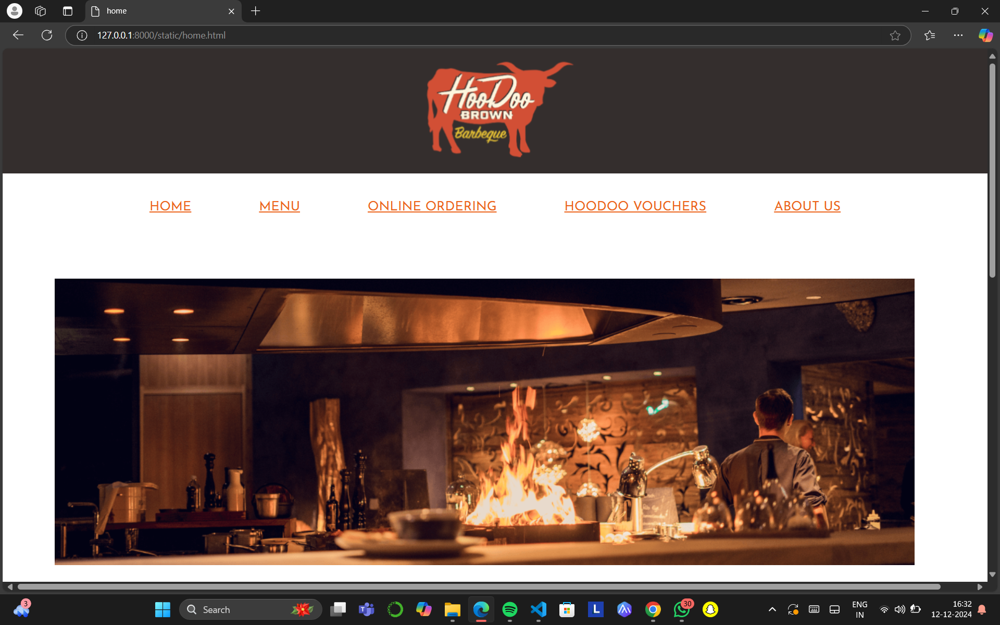
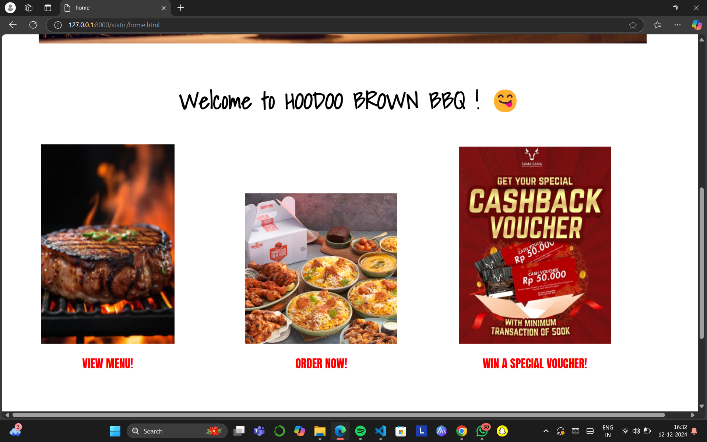
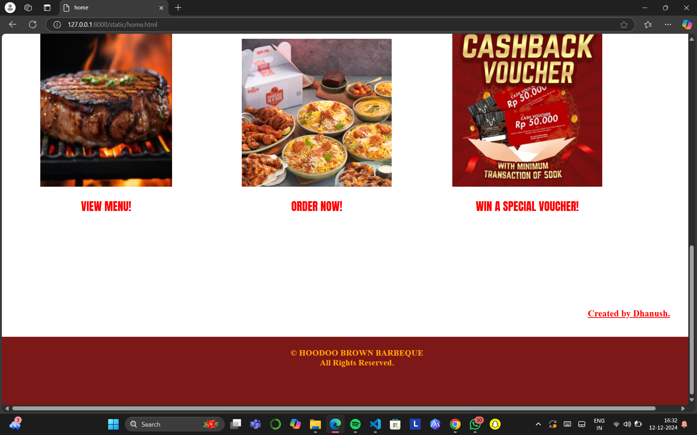
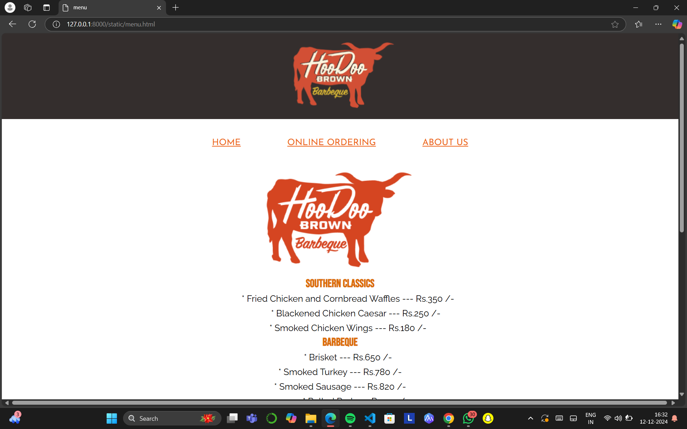
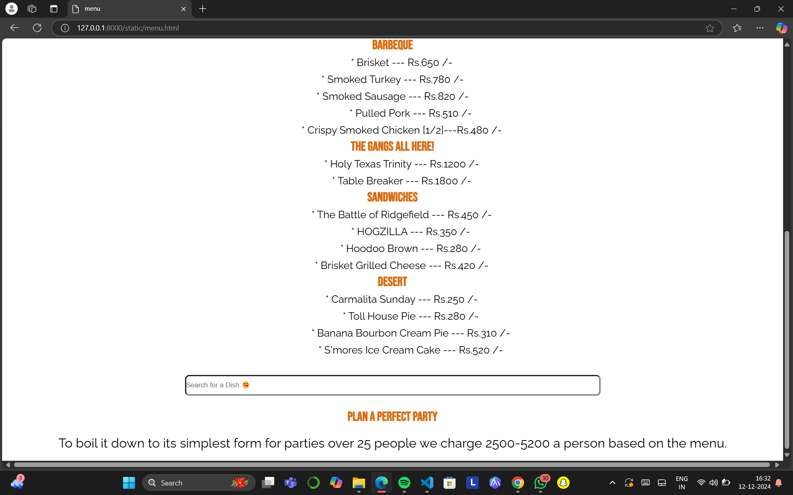
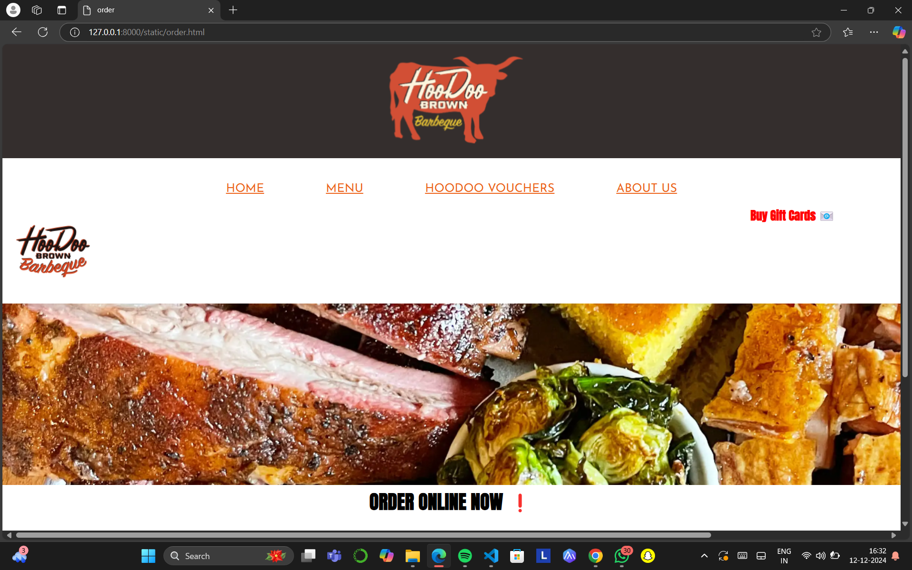
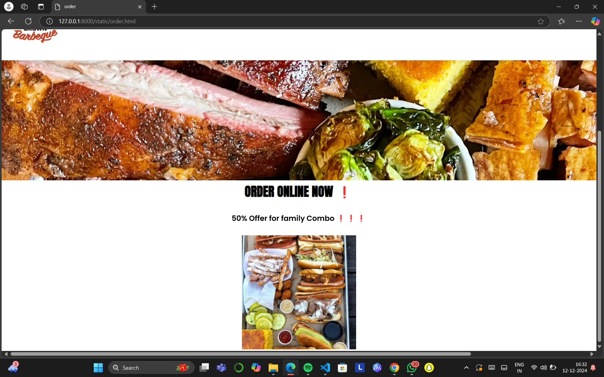
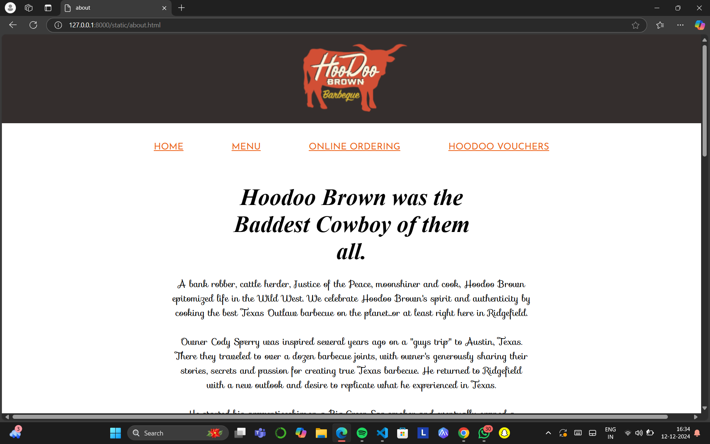
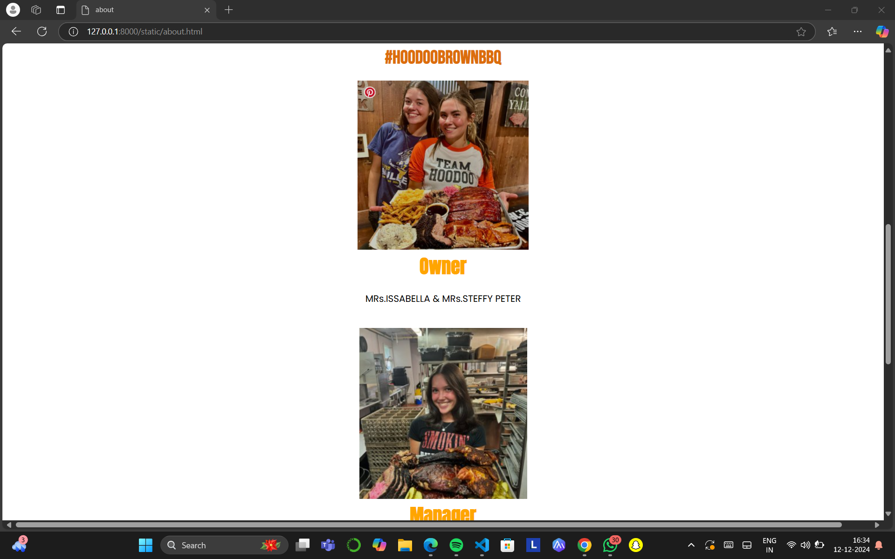
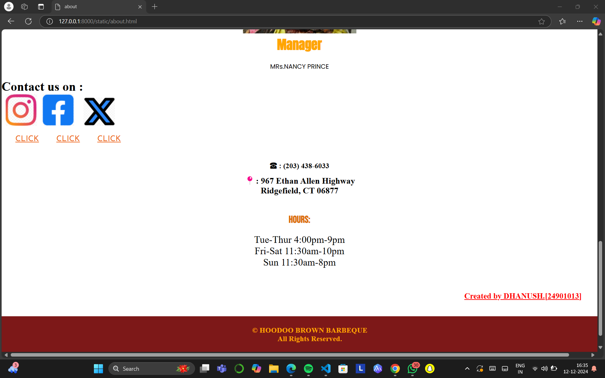

# Ex.07 Restaurant Website
## Date:12/12/2024

## AIM:
To develop a static Restaurant website to display the food items and services provided by them.

## DESIGN STEPS:

### Step 1:
Requirement collection.

### Step 2:
Creating the layout using HTML and CSS.

### Step 3:
Updating the sample content.

### Step 4:
Choose the appropriate style and color scheme.

### Step 5:
Validate the layout in various browsers.

### Step 6:
Validate the HTML code.

### Step 7:
Publish the website in the given URL.

## PROGRAM:

```
home.html

<!DOCTYPE html>
<html lang="en">
<head>
    <meta charset="UTF-8">
    <meta name="viewport" content="width=device-width, initial-scale=1.0">
    <title>home</title>
    <link
        href="https://fonts.googleapis.com/css2?family=Poppins:wght@300;400;600&family=Roboto:wght@300;400;500&family=Gloock&display=swap"
        rel="stylesheet">
        <link href="https://fonts.googleapis.com/css2?family=Josefin+Sans:ital,wght@0,100..700;1,100..700&display=swap" rel="stylesheet">  
        <link href="https://fonts.googleapis.com/css2?family=Edu+AU+VIC+WA+NT+Arrows:wght@400..700&family=Josefin+Sans:ital,wght@0,100..700;1,100..700&family=Shadows+Into+Light&display=swap" rel="stylesheet">
        <link rel="stylesheet" href="https://fonts.googleapis.com/css?family=Audiowide|Sofia|Trirong">
        <link href="https://fonts.googleapis.com/css2?family=Anton&family=Edu+AU+VIC+WA+NT+Arrows:wght@400..700&family=Josefin+Sans:ital,wght@0,100..700;1,100..700&family=Shadows+Into+Light&display=swap" rel="stylesheet">

    <link rel="stylesheet" href="style.css">
</head>
<body bgcolor="white">

    <div class="heading">
        
       

    </div>
    <nav align="center">
        <ul align="center">
        <li><a href="home.html" >HOME</a></li>
        <li><a href="menu.html" >MENU</a></li>
        <li><a href="order.html">ONLINE ORDERING</a></li>
        <li><a href="voucher.html">HOODOO VOUCHERS</a></li>
        <li><a href="about.html">ABOUT US</a></li>
        </ul>
    </nav>
    <div class="homepage">
       
    </div>
    <div>
      <h1 class="welcome" >Welcome to HOODOO BROWN BBQ ! 😋</h1>
      
    </div>
    <div class="b1">
    <center>
        
        <p class="hyper">VIEW MENU!</p>
    </center>
    </div>
    <div class="b2">
    <center>
       
       <p class="hyper">ORDER NOW!</p>
    </center>
    </div>
    <div class="b3">
    <center>
       
       <p class="hyper">WIN A SPECIAL VOUCHER!</p>
    </center>
    </div>
    <h1 class="creator">
        Created by Dhanush.
    </h1>
    <div class="bottom">
        <h3 align="center">© HOODOO BROWN BARBEQUE <br>
        All Rights Reserved.</h3>


    </div>
    


    
</body>
</html>

menu.html

<!DOCTYPE html>
<html lang="en">
<head>
    <meta charset="UTF-8">
    <meta name="viewport" content="width=device-width, initial-scale=1.0">
    <title>menu</title>
    <link
        href="https://fonts.googleapis.com/css2?family=Poppins:wght@300;400;600&family=Roboto:wght@300;400;500&family=Gloock&display=swap"
        rel="stylesheet">
        <link href="https://fonts.googleapis.com/css2?family=Josefin+Sans:ital,wght@0,100..700;1,100..700&display=swap" rel="stylesheet">  
        <link href="https://fonts.googleapis.com/css2?family=Edu+AU+VIC+WA+NT+Arrows:wght@400..700&family=Josefin+Sans:ital,wght@0,100..700;1,100..700&family=Shadows+Into+Light&display=swap" rel="stylesheet">
        <link rel="stylesheet" href="https://fonts.googleapis.com/css?family=Audiowide|Sofia|Trirong">
        <link href="https://fonts.googleapis.com/css2?family=Anton&family=Edu+AU+VIC+WA+NT+Arrows:wght@400..700&family=Josefin+Sans:ital,wght@0,100..700;1,100..700&family=Shadows+Into+Light&display=swap" rel="stylesheet">
        <link href="https://fonts.googleapis.com/css2?family=Anton&family=Bebas+Neue&family=Edu+AU+VIC+WA+NT+Arrows:wght@400..700&family=Josefin+Sans:ital,wght@0,100..700;1,100..700&family=Shadows+Into+Light&display=swap" rel="stylesheet">
        <link href="https://fonts.googleapis.com/css2?family=Anton&family=Bebas+Neue&family=Edu+AU+VIC+WA+NT+Arrows:wght@400..700&family=Josefin+Sans:ital,wght@0,100..700;1,100..700&family=Raleway:ital,wght@0,100..900;1,100..900&family=Shadows+Into+Light&display=swap" rel="stylesheet">
    <link rel="stylesheet" href="style.css">
</head>
<body bgcolor="white">

    <div class="heading">
        
       

    </div>
    <nav align="center">
        <ul align="center">
        <li><a href="home.html" >HOME</a></li>
        <li><a href="order.html">ONLINE ORDERING</a></li>
        <li><a href="about.html">ABOUT US</a></li>
        </ul>
    </nav>
    <center>
        
    </center>
    <h1 class="itemshead">
        Southern Classics
        <ol><li>*  Fried Chicken and Cornbread Waffles      ---       Rs.350 /-<br></li>
            <li>*  Blackened Chicken Caesar      ---      Rs.250 /-<br>  </li>
        <li>*  Smoked Chicken Wings      ---    Rs.180 /-</li><br></ol>
        Barbeque
        <ol><li>
            *   Brisket   ---   Rs.650 /- <br> *    Smoked Turkey     ---   Rs.780 /-  <br>   *     Smoked Sausage      ---     Rs.820 /-<br>
        </li>
        <li>*   Pulled Pork  ---  Rs.510 /-<br></li>
        <li>*   Crispy Smoked Chicken [1/2]---Rs.480 /-</li><br>
    </ol>
    The Gangs All Here!
    <ol><li>*   Holy Texas Trinity   ---  Rs.1200 /-<br></li>
    <li>*   Table Breaker   ---   Rs.1800 /-</li></ol>
    Sandwiches
    <ol><li>*   The Battle of Ridgefield  ---   Rs.450 /-<br></li>
    <li>*   HOGZILLA   ---   Rs.350 /-<br></li>
    <li>*   Hoodoo Brown   ---   Rs.280 /-<br></li>
    <li>*   Brisket Grilled Cheese    ---   Rs.420 /-</li><br></ol>
    Desert
    <ol><li>*   Carmalita Sunday   ---   Rs.250 /-<br></li>
    <li>*    Toll House Pie    ---   Rs.280 /-<br></li>
<li>*   Banana Bourbon Cream Pie   ---  Rs.310 /-<br></li>
<li>*   S'mores Ice Cream Cake   ---   Rs.520 /-<br></li></ol>

    </h1>
    <div class="search">
        <center>
        <input placeholder="Search for a Dish 😋" >
        </center>

    </div>


    <h1 class="party">
        Plan a Perfect Party

        <p>To boil it down to its simplest form for parties over 25 people we charge 2500-5200 a person based on the menu.</p>
    </h1>
   
order.html

<!DOCTYPE html>
<html lang="en">
<head>
    <meta charset="UTF-8">
    <meta name="viewport" content="width=device-width, initial-scale=1.0">
    <title>order</title>
    <link
        href="https://fonts.googleapis.com/css2?family=Poppins:wght@300;400;600&family=Roboto:wght@300;400;500&family=Gloock&display=swap"
        rel="stylesheet">
        <link href="https://fonts.googleapis.com/css2?family=Josefin+Sans:ital,wght@0,100..700;1,100..700&display=swap" rel="stylesheet">  
        <link href="https://fonts.googleapis.com/css2?family=Edu+AU+VIC+WA+NT+Arrows:wght@400..700&family=Josefin+Sans:ital,wght@0,100..700;1,100..700&family=Shadows+Into+Light&display=swap" rel="stylesheet">
        <link rel="stylesheet" href="https://fonts.googleapis.com/css?family=Audiowide|Sofia|Trirong">
        <link href="https://fonts.googleapis.com/css2?family=Anton&family=Edu+AU+VIC+WA+NT+Arrows:wght@400..700&family=Josefin+Sans:ital,wght@0,100..700;1,100..700&family=Shadows+Into+Light&display=swap" rel="stylesheet">

    <link rel="stylesheet" href="style.css">
</head>
<body bgcolor="white">

    <div class="heading">
        
       

    </div>
    <nav align="center">
        <ul align="center">
        <li><a href="home.html" >HOME</a></li>
        <li><a href="menu.html" >MENU</a></li>
        <li><a href="voucher.html">HOODOO VOUCHERS</a></li>
        <li><a href="about.html">ABOUT US</a></li>
        </ul>
    </nav>
    <div class="dash">
    <left>
    
    </left>
    <h1>Buy Gift Cards 📧</h1>    
    
    </div>
    
    <div class="apps">
    <h1> ORDER ONLINE NOW ❗</h1>
    <h3>50% Offer for family Combo ❗❗❗</h3>
    <center>
    
    </center>
    </div>

about.html

<!DOCTYPE html>
<html lang="en">
<head>
    <meta charset="UTF-8">
    <meta name="viewport" content="width=device-width, initial-scale=1.0">
    <title>about</title>
    <link
        href="https://fonts.googleapis.com/css2?family=Poppins:wght@300;400;600&family=Roboto:wght@300;400;500&family=Gloock&display=swap"
        rel="stylesheet">
        <link href="https://fonts.googleapis.com/css2?family=Josefin+Sans:ital,wght@0,100..700;1,100..700&display=swap" rel="stylesheet">  
        <link href="https://fonts.googleapis.com/css2?family=Edu+AU+VIC+WA+NT+Arrows:wght@400..700&family=Josefin+Sans:ital,wght@0,100..700;1,100..700&family=Shadows+Into+Light&display=swap" rel="stylesheet">
        <link rel="stylesheet" href="https://fonts.googleapis.com/css?family=Audiowide|Sofia|Trirong">
        <link href="https://fonts.googleapis.com/css2?family=Anton&family=Edu+AU+VIC+WA+NT+Arrows:wght@400..700&family=Josefin+Sans:ital,wght@0,100..700;1,100..700&family=Shadows+Into+Light&display=swap" rel="stylesheet">
        <link href="https://fonts.googleapis.com/css2?family=Anton&family=Bebas+Neue&family=Edu+AU+VIC+WA+NT+Arrows:wght@400..700&family=Josefin+Sans:ital,wght@0,100..700;1,100..700&family=Shadows+Into+Light&display=swap" rel="stylesheet">
    <link rel="stylesheet" href="style.css">
</head>
<body bgcolor="white">

    <div class="heading">
        
       

    </div>
    <nav align="center">
        <ul align="center">
        <li><a href="home.html" >HOME</a></li>
        <li><a href="menu.html" >MENU</a></li>
        <li><a href="order.html">ONLINE ORDERING</a></li>
        <li><a href="voucher.html">HOODOO VOUCHERS</a></li>
        </ul>
    </nav>
    <h1 class="quote">Hoodoo Brown was the<br> Baddest Cowboy of them <br>all. </h1>
    <p class="menup">
        A bank robber, cattle herder, Justice of the Peace, moonshiner and cook, Hoodoo Brown<br> epitomized life in the Wild West. We celebrate Hoodoo Brown's spirit and authenticity by <br>cooking the best Texas Outlaw barbecue on the planet...or at least right here in Ridgefield.<br><br>
        Owner Cody Sperry was inspired several years ago on a "guys trip" to Austin, Texas.<br> There they traveled to over a dozen barbecue joints, with owner's generously sharing their <br>stories, secrets and passion for creating true Texas barbecue. He returned to Ridgefield<br> with a new outlook and desire to replicate what he experienced in Texas.<br><br>
        He started his apprenticeship on a Big Green Egg smoker and eventually opened a <br>barbecue catering business. Through the encouragement of his customers, friends and<br> family, he decided to open Hoodoo Brown BBQ. <br>
        Which brings us to today, Hoodoo Brown Barbeque opened May 22nd, 2015 and we are<br> happy to bring our style of outlaw barbecue to the Northeast. Hoo's Hungry?<br>
    </p>
    <h1 class="hash">
        #HOODOOBROWNBBQ
    </h1>
    <div class="red">
       <div class="owner">
        <center>
         
         <h1 class="o">Owner</h1>
         <p class="name">MRs.ISSABELLA  &  MRs.STEFFY PETER</p>
        </center>
       </div>
     

    </div>
        <div class="owner">
            <center>
         
         <h1 class="o">Manager</h1>
         <p class="name">MRs.NANCY PRINCE</p>
        </center>
        </div>
    <h1>Contact us on :<br></h1>
    <div class="link">
    <center>
        
        <p><a href="https://www.instagram.com/hoodoobrownbbq ">CLICK</a></p>
    
        
    </div>
    
    <div class="link">
        
        <p><a href="https://www.facebook.com/hoodoobrownbbq">CLICK</a></p>
    </div>
    <div class="link">
        
        <p><a href="https://twitter.com/HoodooBrownBBQ">CLICK</a></p>
    </center>
    </div>
    <h3 class="contact">
        ☎ : (203) 438-6033 <br>
        <center>
        <h3>📍: 967 Ethan Allen Highway<br>
            Ridgefield, CT 06877</h3>
        </center>    

    </h3>
    <h3 class="h">
        HOURS:
        <p class="timing">Tue-Thur 4:00pm-9pm<br>
            Fri-Sat 11:30am-10pm<br>
            Sun 11:30am-8pm</p>
    </h3>
    <h1 class="creator">
        Created by DHANUSH.[24901013]
    </h1>
    <div class="bottom">
        <h3 align="center">© HOODOO BROWN BARBEQUE <br>
        All Rights Reserved.</h3>


    </div>
    
        
style.css

*{
    padding:0;
    margin:0;
}
nav{
    margin-top:15px
    
}
.ul,a,li{
    display: inline;
    margin:15px;
    font-family: Josefin Sans;
    font-size: 20px;
    color: rgba(236, 93, 17, 0.962);
  
    cursor:pointer;
    
}
.ul,a:hover{
    font-size: 22px;
    color:red;
    text-decoration-line: underline;
} 
 .homepage{
    margin:80px;
 }
 .welcome{
    font-family: Shadows Into Light;
    text-align: center;
    font-size: 50px;
 }
 .b1{
    width: 350px;
    height: 500px;
    background-color: white;
    display: inline-block;
    margin:55px;
    border-radius: 5px;
    
 }
 .b2{
    width: 350px;
    height: 500px;
    background-color: white;
    display: inline-block;
    margin:55px;
    
 }
 .b3{
    width: 350px;
    height: 500px;
    background-color: white;
    display: inline-block;
    margin:55px;
    }
 .hyper{
    font-family: Anton;
    padding:20px; 
    font-size: 25px;
    color:red;
 }
 .hyper:hover{
    color:yellow;
    cursor:pointer;
 }
.creator{
    font-family: italic;
    font-size: 20px;
    text-align: right;
    color:red;
    padding: 40px;
    text-decoration: underline;
    
} 
.bottom{
    height: 100px;
    width: 1515px;
    background-color: rgb(125, 24, 24);
    color: orange;
    padding:25px;
}
.quote{
   font-style: italic;
   font-size: 50px;
   text-align: center;
   padding-top: 50px;
}
.menup{
   font-family: Sofia;
   text-align: center;
   font-size: 20px;
   padding-top: 25px;
}
.itemshead{
   font-family: Bebas Neue;
   font-size: 25px;
   text-align: center;
   padding: 50pxpx;
   color: rgb(220, 109, 12);
}
ul,li{
   font-family: Raleway;
   color:black;
   padding-top: 30px;
   font-weight:normal;
   padding:20px;
}
.party{
   font-family: Bebas Neue;
   font-size: 25px;
   text-align: center;
   padding: 50pxpx;
   color: rgb(220, 109, 12);
}
p{
   font-family: Raleway;
   color:black;
   padding-top: 30px;
   font-weight:normal;
   padding:20px;
}
.dash{
   display:flex;
   align-items: left;
   font-family: Anton;
   font-size: 10px;
   margin-left: 10px;
   color:red;

}
.dash img{
   margin-right: 1100px;
   margin-bottom: 10px;

   
}
input{
   width: 800px;;
   height:35px;
   margin-bottom: 25px;
   border-width: 3px;
   border-radius: 8px;
}
.dash h1:hover{
   cursor:pointer;
   color:grey;

}
.apps h1{
   font-family: Anton;
   text-align: center;
}
.apps h3{
   font-family: Poppins;
   text-align: center;
   padding: 30px;
}
.hash{
   font-family: Bebas Neue;
   color:rgb(220, 109, 12);
   text-align: center;
}
.owner{
   width: 350px;
    height: 500px;
    background-color: pink;
    display: inline;
    margin-left:55px;
    border-radius: 5px;
    padding-top: 35px;
}

.name{
   font-family: Poppins;
   color: black;
}
.o{
   font-family: Anton;
   color:orange;
}
.link{
   width: 100px;
   height: 100px;
   display:inline-block; 
   background-color: white;  
   align-items: center;
}
.contact{
   padding-top: 45px;
   text-align: center;
}
.contact h3{
   padding:10px;
   text-align: center;
}
.h{
   font-family: Bebas Neue;
   font-size: 25px;
   text-align: center;
   padding-top: 35px;
   color: rgb(220, 109, 12);
}
.timing{
   font-family: Raleway;
   color:black;
   padding-top: 30px;
   font-weight:normal;
   padding:20px;
}


```


## OUTPUT:












## RESULT:
The program for designing software company website using HTML and CSS is completed successfully.
